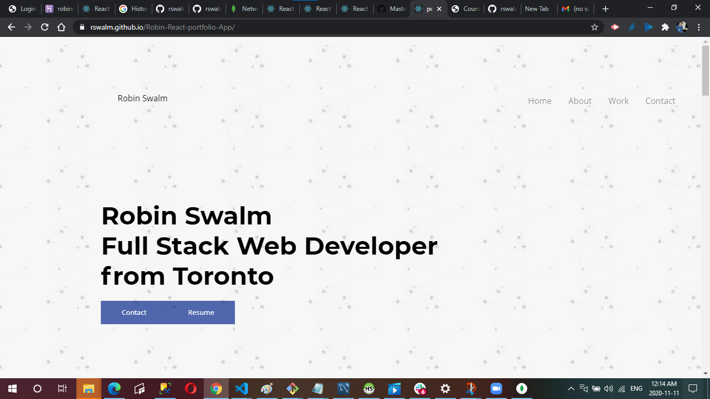
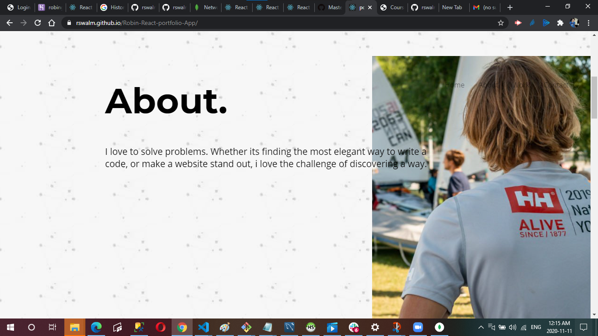
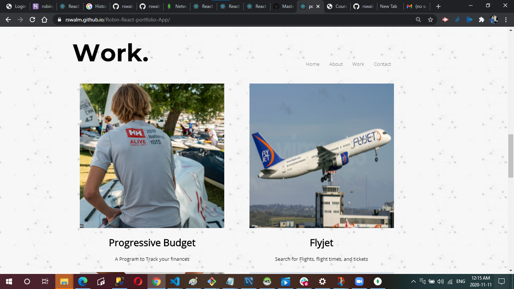
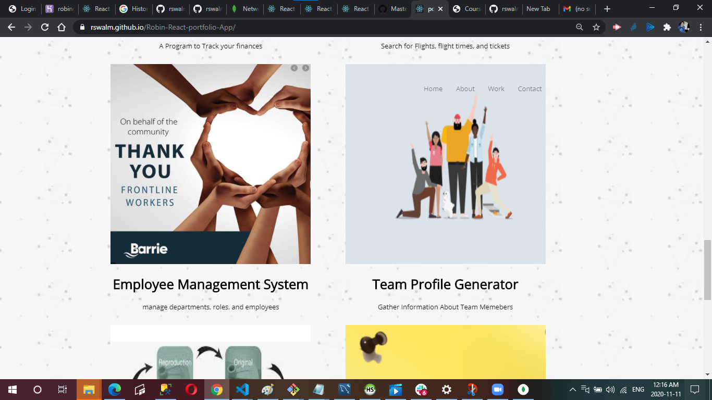
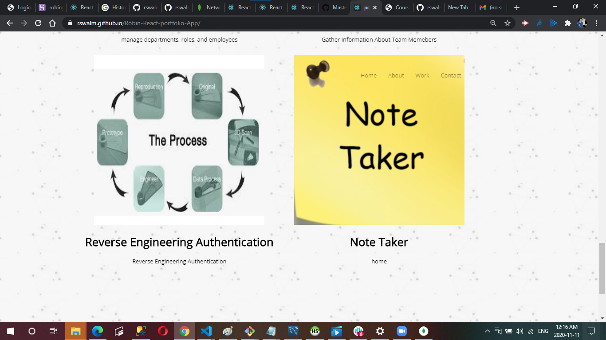
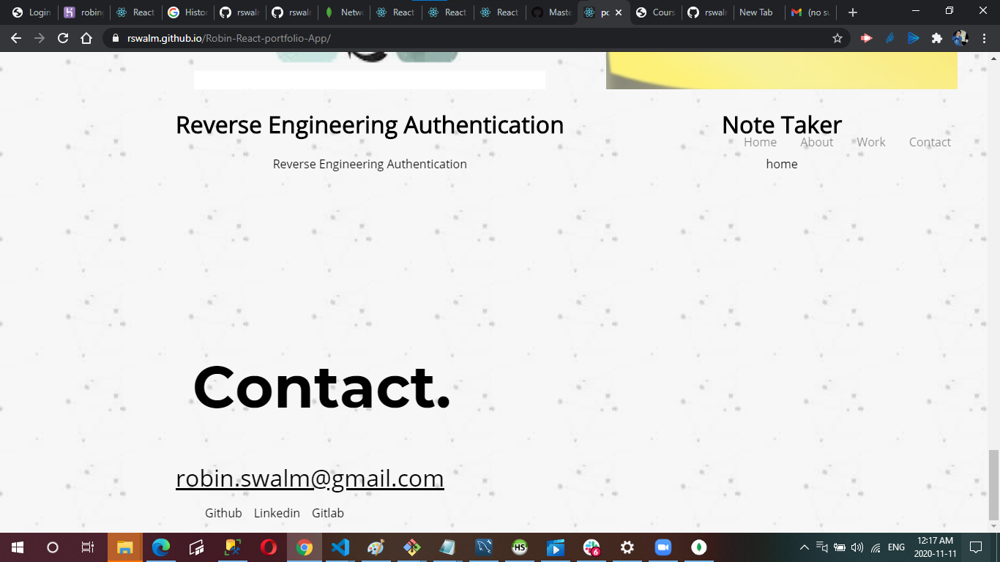
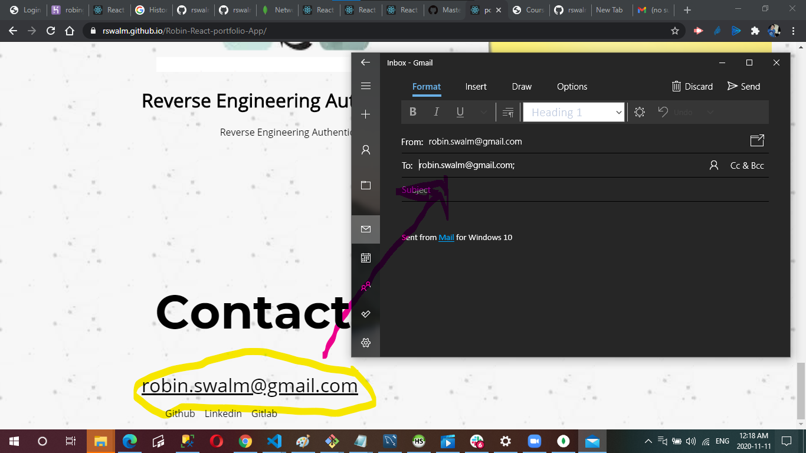

# React Portfolio

## My Updated portfolio

I have Updated my portfolio featuring 6 total projects. I used react for this assignment. My portfolio has a "Header" component that appears on multiple pages. It also features a single "Project" component that will be used multiple times on a single page, a Navigation with React Router, dynamic rendering, or another third part router, A "Footer" component that appears on multiple pages and my Update GitHub profile with pinned repositories featuring those same projects. This web application is deployed using github pages.

# Screenshots

# Github Page Link

https://rswalm.github.io/Robin-React-portfolio-App/

# Github Repository

https://github.com/rswalm/Robin-React-portfolio-App/

